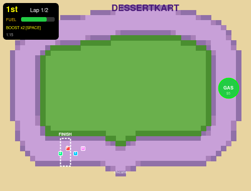
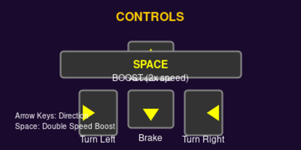
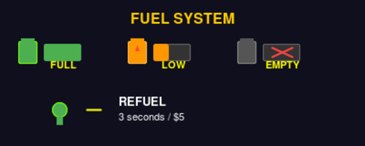
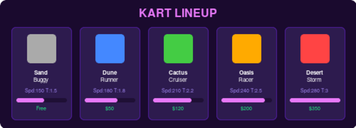

# DessertKart 🏜️🏎️

A 2D desert-themed kart racing game built with Phaser 3 and TypeScript. Race against 3 AI opponents on a curved desert circuit, manage your fuel, bump rivals off course, and use speed boosts to cross the finish line first.



## How to Play

### Getting Started

1. **Register or log in** — create an account to save your progress, money, and karts.
2. **Hit RACE** from the main menu to jump into a race.
3. A **3-2-1-GO countdown** plays before the race begins. Use this time to plan your line.
4. Complete **2 laps** around the circuit before time runs out (90 seconds) to finish the race.
5. **Earn prize money** based on your finishing position: 1st = $30, 2nd = $20, 3rd = $10.

### Controls



| Key | Action |
|-----|--------|
| ⬆️ UP | Accelerate |
| ⬇️ DOWN | Brake / Reverse |
| ⬅️ LEFT | Turn left |
| ➡️ RIGHT | Turn right |
| SPACE | Activate speed boost (2x speed for 5 seconds) |

### The Track

The circuit is a curved desert loop with rounded corners, a **chicane** (S-curve) on the bottom straight, and a **kink** on the top straight. The track has hard walls — you can't drive off the road. If you hit the edge, you'll bounce back and lose speed. The interior is grassy desert, and the outside is sand.

### Fuel System



Your kart has a limited fuel tank that drains as you drive. The faster you go, the faster it drains.

- The **fuel gauge** in the top-left HUD turns from green → orange → red as fuel depletes.
- When fuel hits zero, you **can't accelerate** — you'll coast to a stop.
- Drive through the **GAS stop** on the right straight to refuel. It costs **$5** and takes **3 seconds**. Your kart is frozen during refueling with a progress bar on screen.
- A **low fuel warning** beeps when you're running low.
- Better karts have bigger tanks — the Sand Buggy (1.5) needs to refuel, while the Desert Storm (3.0) can nearly finish the whole race on one tank.

### Collisions

Bump into an AI racer and **both karts slow way down**. Use this tactically — nudge a rival right before a corner to take the lead, but be careful not to slow yourself down at the wrong moment. Karts push apart on contact so you won't get stuck.

### Speed Boosts

Buy boosts in the **Shop** for **$10 each**. During a race, press **SPACE** to activate one. Your kart goes **2x speed for 5 seconds** and flashes yellow. Boosts are one-time use — once activated, it's gone. Stock up before a race!

### Karts



| Kart | Speed | Fuel Tank | Price |
|------|-------|-----------|-------|
| Sand Buggy | 150 | 1.5 | Free |
| Dune Runner | 180 | 1.8 | $50 |
| Cactus Cruiser | 210 | 2.2 | $120 |
| Oasis Racer | 240 | 2.5 | $200 |
| Desert Storm | 280 | 3.0 | $350 |

Faster karts have bigger fuel tanks, so you spend less time at the gas stop. Earn money by racing and spend it in the shop.

### Screens

- **Menu** — Race, Shop, Profile, or Logout.
- **Shop** — Buy and equip karts. Purchase speed boosts ($10 each).
- **Profile** — View your driver name, current kart, wallet balance, boost count, and owned karts (read-only).
- **Race** — The main event. 2 laps, 90 seconds, 4 racers.
- **Results** — See final standings and prize money earned.

## Tech Stack

- **Game Engine:** [Phaser 3](https://phaser.io/) (v3.88)
- **Language:** TypeScript
- **Build Tool:** Vite
- **Backend API:** Cloudflare Workers + Hono + D1 (SQLite)
- **Auth:** JWT-based login/register
- **Testing:** Vitest (119 tests)
- **Audio:** Procedural music via Web Audio API + Kenney SFX library

## Project Structure

```
dessertkart/
├── game/                    # Client-side Phaser game
│   ├── src/
│   │   ├── scenes/          # BootScene, LoginScene, MenuScene, RaceScene,
│   │   │                    #   ResultsScene, ShopScene, ProfileScene
│   │   ├── objects/         # Player, AIRacer, RaceManager, MusicManager
│   │   ├── config/          # trackData, waypoints, karts
│   │   └── utils/           # auth, api
│   └── public/assets/       # Sprites, tiles, sounds (Kenney assets)
├── api/                     # Cloudflare Workers backend
│   └── src/
│       ├── routes/          # auth, user, shop
│       ├── middleware/       # JWT auth
│       └── utils/           # jwt, crypto, catalog, prizes
└── docs/                    # README images
```

## Development

### Prerequisites

- Node.js 18+
- npm

### Local Setup

```bash
# Install dependencies
npm install

# Start the game dev server (port 5173)
cd game && npx vite

# Start the API dev server (port 8787) — requires Wrangler
cd api && npx wrangler dev
```

### Running Tests

```bash
npx vitest run
```

All 119 tests should pass across game scenes, objects, configs, and API routes.

### Building for Production

```bash
cd game && npx vite build
```

## Credits

- **Tile assets:** [Kenney's Desert Racing Pack](https://kenney.nl/) (CC0 1.0)
- **Sound effects:** [Kenney's Interface Sounds](https://kenney.nl/) (CC0 1.0)
- **Music:** Procedurally generated via Web Audio API
